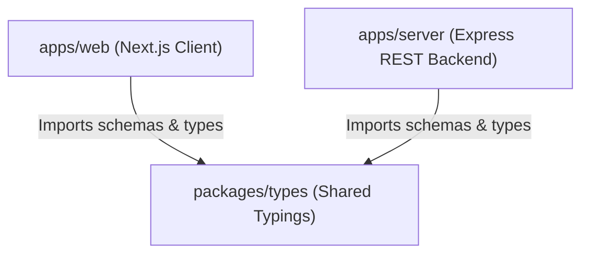
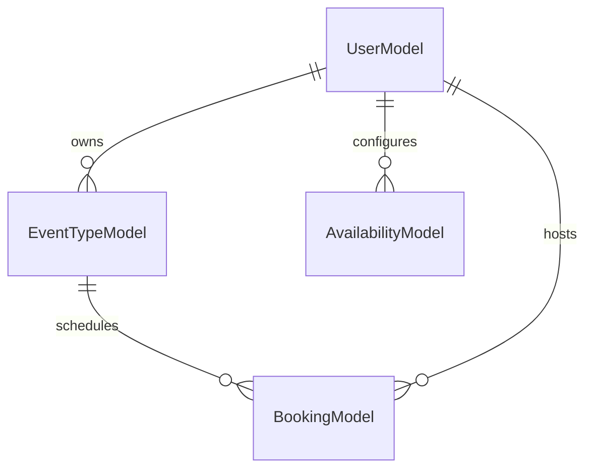
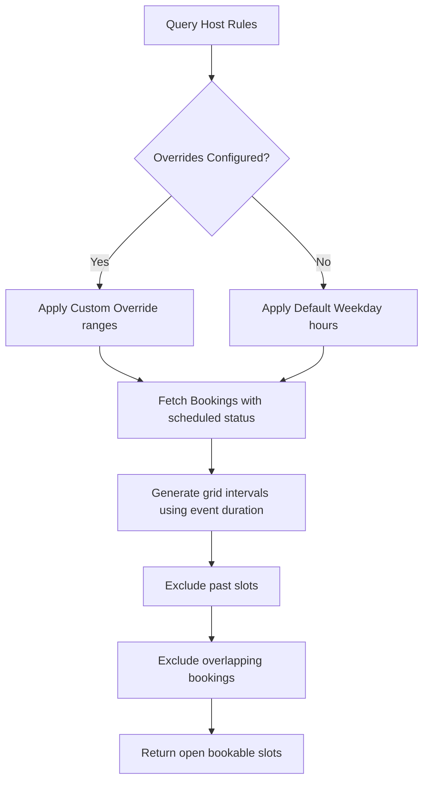

# CalClone — Production-Grade Open Source Scheduling Infrastructure

[](https://nextjs.org)
[](https://expressjs.com)
[](https://mongodb.com)
[](https://typescriptlang.org)
[](https://opensource.org/licenses/MIT)

**CalClone** is a production-grade, highly performant, open-source scheduling infrastructure inspired by Cal.com. Architected as a modern **MERN (MongoDB, Express, React/Next.js, Node) monorepo** with strict TypeScript validation, it enables hosts to configure reusable meeting templates, manage recurrent availability, and generate available booking time slots in real-time while preventing calendar double-bookings.

---

## 🚀 Live Demo & Hosting

*   **Live Web Client**: [https://calclone-web.vercel.app](https://calclone-web.vercel.app)
*   **Live API Backend**: [https://calclone-server.onrender.com/health](https://calclone-server.onrender.com/health)
*   **Cloud Database**: MongoDB Atlas Shared Cluster

---

## 🛠 Tech Stack

*   **Frontend**: Next.js (v15.0 App Router), TypeScript, Tailwind CSS, Framer Motion, React Hook Form, Zod.
*   **Backend**: Express.js, TypeScript, Mongoose, Day.js (Timezone & UTC plugins), Cors, Helmet.
*   **Workspace**: npm workspaces monorepo structure with shared types packages.

---

## 📋 Core Features

1.  **Event Type Creator**: Manage reusable templates with custom titles, slugs, durations, descriptions, and active status.
2.  **Availability Engine**: Configure timezone-aware recurrent working hours (e.g. 09:00 - 17:00) and active weekdays.
3.  **Real-Time Slot Generator**: Generates available time slots dynamically, excluding past slots and overlapping scheduled meetings.
4.  **Public Booking Flow**: Seamless scheduling calendars that prompt guest details and redirect immediately on success.
5.  **Double-Booking Shield**: Atomic database validation blocks duplicate booking attempts.
6.  **Dashboard Hub**: Recruiter-ready dashboard featuring card grids, tab selectors, and optimistic UI cancellations.
7.  **Responsive Layouts**: Designed for mobile, tablet, and desktop views.

---

## 🏗 System Architecture

CalClone is built using a clean monorepo architecture:

```text
├── apps/
│   ├── server/             # Express.js backend (MVC pattern)
│   └── web/                # Next.js 15 client
├── packages/
│   └── types/              # Shared TypeScript definitions
```

### Monorepo Dependency Flow



---

## 🗄 Database Design

We utilize MongoDB with Mongoose schemas, using indices to optimize query performance:



### Models Overview

1.  **`User`**: Fields for `name`, `email`, and timezone.
2.  **`EventType`**: Reusable templates featuring `title`, unique `slug`, `duration` in minutes, `timezone`, and `isActive` flag.
3.  **`Availability`**: Configures weekly schedules using a nested `weeklySlots` array and `dateOverrides`.
4.  **`Booking`**: Records guest appointments, saving `startTime`, `endTime`, `guestEmail`, `status` (`scheduled` | `cancelled`), and indices to speed up queries.

---

## ⚡ Slot Generation Engine

The Slot Engine is a critical core module that calculates open time slots for a host:



---

## 🔌 API Documentation

### Event Types (`/api/event-types`)
*   `GET /` — List all event templates.
*   `POST /` — Create a template.
*   `PUT /:id` — Update configuration.
*   `DELETE /:id` — Delete template.

### Availability (`/api/availability`)
*   `GET /` — Fetch active timezone and working schedules.
*   `POST /` / `PUT /:id` — Configure active days.

### Slot Finder (`/api/slots`)
*   `GET /api/slots?slug=15-min-call&date=2026-05-22` — Returns bookable intervals.

### Bookings (`/api/bookings`)
*   `POST /` — Book an appointment.
*   `GET /` — Fetch scheduled list.
*   `PATCH /:id/cancel` — Cancel appointment.

---

## 💻 Local Development Setup

Follow these steps to run CalClone locally:

### 1. Prerequisites
Ensure you have **Node.js v18+** and **MongoDB** installed.

### 2. Clone and Install
```bash
git clone https://github.com/Yuvraj264/Cal-clone.git
cd "cal clone"
npm install
```

### 3. Configure Variables
Create `.env` files in both workspace directories:

*   **`apps/server/.env`**:
    ```env
    PORT=5000
    MONGO_URI=mongodb://localhost:27017/calclone
    CLIENT_URL=http://localhost:3000
    NODE_ENV=development
    ```

*   **`apps/web/.env.local`**:
    ```env
    NEXT_PUBLIC_API_URL=http://localhost:5000/api
    ```

### 4. Run Services
Start both services in development mode:
```bash
# Run server & web client simultaneously
npm run dev
```

---

## 🛡 Engineering Decisions

*   **Decoupled Typings Package**: Shared TypeScript models ensure consistency across API endpoints, data forms, and client components.
*   **Centralized Error Interceptor**: An Express error middleware formats all MongoDB validation errors, CastErrors, and operational failures before returning them to the client.
*   **Optimistic UI with Rollback**: Dashboard deletions and cancellations update the UI instantly to feel fast and responsive, while holding a data backup to rollback state if the API fails.
*   **Client-side Caching**: A lightweight Axios cache caches GET requests for 30 seconds to minimize redundant fetches.

---

## 📈 Future Improvements

*   **Authentication Hub**: Add secure login layers using JWT or NextAuth.
*   **Google Calendar Sync**: Sync live events to host Google accounts.
*   **Automatic Email Invites**: Send email invites to guests upon booking.

---

## 🖼 Screenshots

*(Add your application screenshots here)*
*   **Dashboard View**: `[Placeholder: apps/web/public/dashboard-screenshot.png]`
*   **Availability View**: `[Placeholder: apps/web/public/availability-screenshot.png]`
*   **Public Scheduler View**: `[Placeholder: apps/web/public/scheduler-screenshot.png]`

---

## 📄 License

Distributed under the MIT License. See `LICENSE` for more details.
