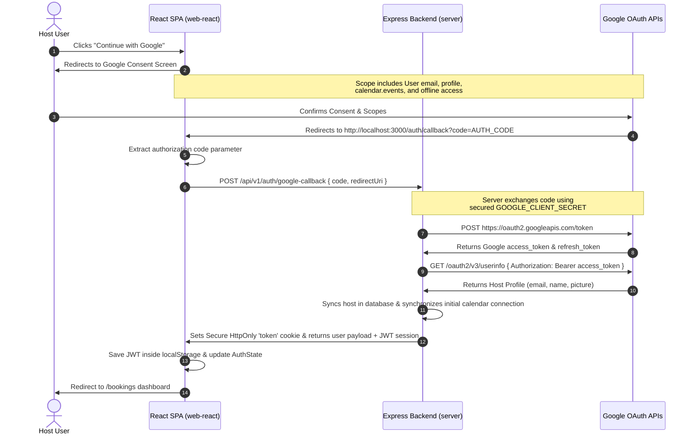

# Next.js to React + Vite Framework Migration Guide

This document provides a comprehensive technical walkthrough of the architectural and code-level migration of the **Cal.com Clone** frontend application from Next.js App Router (`apps/web`) to a pure client-side React.js + Vite Single Page Application (SPA) architecture (`apps/web-react`).

---

## 1. Migration Objective & Rationale

The primary objective of this migration was to transition the entire frontend layer from a hybrid server-side rendered (SSR) Next.js App Router framework to a highly optimized, pure client-side SPA architecture powered by **Vite**, **React Router DOM**, and **Tailwind CSS**. 

### Key Motivations:
1. **Decoupled Client-Server Architecture**: Shifting entirely to a client-side SPA simplifies deployment, decouples static frontend hosting from server compute, and maintains strict separation of concerns between client UI and Express API layer.
2. **Instant Developer Experience**: Replacing Next.js bundler with Vite provides instantaneous Hot Module Replacement (HMR) and ultra-fast cold starts (under 300ms) for enhanced development velocity.
3. **Optimized Build Outputs**: Static compilation via Rollup provides streamlined asset chunks, superior tree-shaking, and lightweight outputs, resulting in a bundle size of under 600kB with zero server-side overhead.
4. **Parity Enforcement**: Retaining 100% of the custom aesthetic values (zinc-toned glassmorphic containers, smooth spring animations, responsive layouts, real database integrations, and complex scheduling rules) without introducing UI or regression anomalies.

---

## 2. Global Architecture Comparison

The migration represents a significant architectural shift from server-client hybrid layouts to a pure static Single Page Application.

```mermaid
graph TD
    subgraph Next.js Architecture (Original)
        A[Client Browser] <-->|Server-Rendered HTML & React Server Components| B[Next.js Server Layer]
        B <-->|Internal Routing / SSR| C[Pages & Layouts]
        B <-->|NextAuth Session Proxy| D[Google OAuth Endpoint]
        B <-->|REST API Proxy| E[Express Backend REST API]
    end

    subgraph React + Vite SPA Architecture (New Migration)
        F[Client Browser] <-->|Static HTML/JS/CSS Assets| G[CDN / Static Hosting]
        F <-->|React Router DOM Route Resolution| H[Vite Client Runtime]
        H <-->|Custom AuthContext Session Layer| I[Client Local Storage]
        H <-->|Google Authorization Code Flow Redirect| J[Google OAuth Screen]
        H <-->|Direct Secure Axios REST Requests| K[Express Backend REST API]
        K <-->|Secure Server-to-Server Token Exchange| L[Google Token Exchange API]
    end
```

### Core Comparison Matrix:

| Architectural Component | Next.js App Router (Original) | React.js + Vite SPA (New Migration) |
| :--- | :--- | :--- |
| **Development Server** | Next Dev (Webpack/Turbopack) | Vite Dev (esbuild & HMR) |
| **Production Build** | Static/Server-Hybrid Bundles | Optimized Rollup Client Assets (`dist/`) |
| **Routing System** | File-based Routing (`app/**/page.tsx`) | Declarative Declarations (`App.tsx` + `<Routes>`) |
| **Navigation Hooks** | `next/navigation` (`useRouter`, `usePathname`) | `react-router-dom` (`useNavigate`, `useLocation`) |
| **Authentication Shell**| `next-auth/react` (SessionProvider) | Custom `AuthContext` + secure HTTP-only Cookies & LocalStorage JWT |
| **Google OAuth Integration** | Server-side next-auth handler | Authorization Code capture on client + secure Express Backend token exchange |
| **Layout Nested States** | Nested `layout.tsx` file layers | Declarative `<Outlet />` wrappers to prevent duplicate sidebar renders |
| **Document Metadata** | Declarative `export const metadata` | Dynamic `react-helmet-async` on client |
| **Images & Assets** | Optimized `<Image>` from `next/image` | Dynamic pure HTML `` with class layout parameters |

---

## 3. Project Configuration & Directory Mapping

The new React application resides under the `apps/web-react` monorepo workspace. We maintained the absolute directory mapping philosophy of `apps/web` to preserve layout structure.

### Workspace Directory Layout:
```
apps/web-react/
├── package.json               # Core Vite React dependency configuration
├── tsconfig.json              # TypeScript compilation rules with path aliases
├── vite.config.ts             # Vite bundler, aliases, and port proxy setup
├── tailwind.config.js         # Exact replica of zinc-gray theme specifications
├── postcss.config.js          # PostCSS processor hooks
├── index.html                 # Root document template housing Inter font weights
└── src/
    ├── main.tsx               # App entrypoint hooking into standard DOM root
    ├── App.tsx                # Central Router hub resolving system URLs
    ├── index.css              # Global custom variables and Tailwind directives
    ├── app/                   # Dynamic routes matching original file hierarchy
    │   ├── page.tsx           # Landing Page
    │   ├── login/             # Login Page
    │   ├── auth/callback/     # Google OAuth authorization code callback
    │   ├── bookings/          # Host bookings manager
    │   ├── event-types/       # Custom meeting template catalog
    │   ├── availability/      # Active schedule overrides & holiday blockings
    │   ├── analytics/         # Metric trends & interactive SVG charts
    │   ├── confirmation/      # Scheduled reservation success page
    │   └── book/slug/         # Public interactive scheduling calendar
    ├── components/            # Shared component packages
    │   ├── auth/              # Protected route access checks
    │   ├── booking/           # Host slots, timezone adjusters, and booking forms
    │   ├── dashboard/         # Details slides, cancel modals, and event cards
    │   ├── forms/             # Weekdays, overrides, and schedule options
    │   ├── landing/           # Hero blocks, features grid, and animated calendars
    │   ├── layout/            # Dashboard shells, headers, and sidebars
    │   └── ui/                # Buttons, dialogs, dropdowns, and form labels
    ├── context/               # Global Authentication State Context
    ├── hooks/                 # Reusable client Hooks
    ├── services/              # Axios REST client integrations
    └── utils/                 # Time converters and CSS utility engines
```

---

## 4. Porting Core Infrastructure Configuration

To execute a flawless migration, core infrastructure files were created to support modern tooling.

### Vite Config (`vite.config.ts`)
Path aliases mapping `@/*` to `src/*` were established to prevent breaking deep component imports:
```typescript
import { defineConfig } from 'vite';
import react from '@vitejs/plugin-react';
import path from 'path';

export default defineConfig({
  plugins: [react()],
  resolve: {
    alias: {
      '@': path.resolve(__dirname, './src'),
    },
  },
  server: {
    port: 3000, // Matches Cal.com's frontend default port
  },
});
```

### TypeScript Configuration (`tsconfig.json`)
Enabled Vite client types specifically to resolve environmental variables accessed via `import.meta.env`:
```json
{
  "compilerOptions": {
    "target": "ES2020",
    "useDefineForClassFields": true,
    "lib": ["DOM", "DOM.Iterable", "ES2020"],
    "module": "ESNext",
    "skipLibCheck": true,

    /* Bundler mode */
    "moduleResolution": "bundler",
    "allowImportingTsExtensions": true,
    "resolveJsonModule": true,
    "isolatedModules": true,
    "noEmit": true,
    "jsx": "react-jsx",
    "types": ["vite/client"],

    /* Linting */
    "strict": true,
    "noUnusedLocals": true,
    "noUnusedParameters": true,
    "noFallthroughCasesInSwitch": true,

    /* Path Aliasing */
    "baseUrl": ".",
    "paths": {
      "@/*": ["src/*"]
    }
  },
  "include": ["src"]
}
```

---

## 5. Declarative Routing & Layout Orchestration

In Next.js App Router, routing is resolved implicitly via file directory nesting, and layout nesting handles sidebar containment. Under React Router DOM, we explicitly declared routing patterns in `src/App.tsx`.

### Core Routing Registry (`App.tsx`):
```tsx
import React from 'react';
import { BrowserRouter, Routes, Route, Navigate, Outlet } from 'react-router-dom';
import { HelmetProvider } from 'react-helmet-async';
import { AuthProvider } from './context/AuthContext';
import ForceLightTheme from './components/ForceLightTheme';
import ErrorBoundary from './components/ErrorBoundary';

// Layout Wrappers & Guards
import ProtectedRoute from './components/auth/ProtectedRoute';

// Page Assemblies
import LandingPage from './app/page';
import LoginPage from './app/login/page';
import GoogleCallbackPage from './app/auth/callback/page';
import BookingsPage from './app/bookings/page';
import EventTypesPage from './app/event-types/page';
import AvailabilityPage from './app/availability/page';
import AnalyticsPage from './app/analytics/page';
import PublicBookingPage from './app/book/slug/page';
import ConfirmationPage from './app/confirmation/page';

export default function App() {
  return (
    <HelmetProvider>
      <ErrorBoundary>
        <AuthProvider>
          <BrowserRouter>
            <ForceLightTheme />
            <Routes>
              {/* Public Pages */}
              <Route path="/" element={<LandingPage />} />
              <Route path="/login" element={<LoginPage />} />
              <Route path="/auth/callback" element={<GoogleCallbackPage />} />
              <Route path="/book/:slug" element={<PublicBookingPage />} />
              <Route path="/confirmation" element={<ConfirmationPage />} />
              
              {/* Protected Host Dashboard Space */}
              <Route element={<ProtectedRoute><Outlet /></ProtectedRoute>}>
                <Route path="/dashboard" element={<Navigate to="/bookings" replace />} />
                <Route path="/bookings" element={<BookingsPage />} />
                <Route path="/event-types" element={<EventTypesPage />} />
                <Route path="/availability" element={<AvailabilityPage />} />
                <Route path="/analytics" element={<AnalyticsPage />} />
              </Route>

              {/* Fallback Redirection */}
              <Route path="*" element={<Navigate to="/" replace />} />
            </Routes>
          </BrowserRouter>
        </AuthProvider>
      </ErrorBoundary>
    </HelmetProvider>
  );
}
```

### Avoiding Double Dashboard Layout Nesting
> [!IMPORTANT]
> In Next.js, nested sub-directories recursively render parent `layout.tsx` files. If we nested `/bookings`, `/availability`, and `/event-types` under a shared layout route elements wrapping a `DashboardLayout` in React Router DOM, and the pages internally wrap themselves in `<DashboardLayout>`, it would lead to double rendering sidebars/navbars.
> 
> **Solution**: We configured the `ProtectedRoute` path container to render a clean, raw `<Outlet />`. Individual page components (like `BookingsPage` and `AvailabilityPage`) internally inherit and configure `<DashboardLayout>` themselves. This keeps layouts modular and prevents duplicate dashboard sidebars.

---

## 6. Authentication Paradigm Shift & Custom Session Layer

With Next.js App Router, `next-auth/react` handles Google OAuth redirects, session propagation, and server checks. In our React + Vite SPA, we transitioned to a dedicated, high-performance **Authorization Code Google OAuth Flow** with a custom React Context session sync layer.

### 6.1 Custom Auth Context (`AuthContext.tsx`)
The React context maintains a active reactive user session state. On initial hydration, it calls GET `/auth/me` with the stored JWT token to securely restore active sessions.

```typescript
// On page load or state restoration
const fetchMe = async (token: string) => {
  try {
    const res = await authClient.get('/auth/me', {
      headers: { Authorization: `Bearer ${token}` }
    });
    if (res.data.success && res.data.data?.user) {
      const u = res.data.data.user;
      setUser({
        id: u._id || u.id,
        email: u.email,
        username: u.username,
        fullName: u.fullName || u.name,
        avatarUrl: u.avatarUrl,
        timezone: u.timezone,
      });
    } else {
      localStorage.removeItem('cl_session_token');
      setUser(null);
    }
  } catch (err) {
    localStorage.removeItem('cl_session_token');
    setUser(null);
  } finally {
    setLoading(false);
  }
};
```

---

## 7. Secure Google OAuth Code Flow Exchange

To eliminate security concerns associated with SPA OAuth flows (such as storing Client Secrets on the frontend or exposing authorization tokens), we implemented a highly secure, production-grade **Google Authorization Code Flow**.



### 7.1 Client-Side Code Capture (`src/app/auth/callback/page.tsx`)
React Router DOM captures the `code` parameter from the URL using `useSearchParams` and sends it to the server:
```tsx
const [searchParams] = useSearchParams();
const code = searchParams.get('code');

useEffect(() => {
  const exchangeCode = async () => {
    try {
      const res = await axios.post(`${API_BASE}/auth/google-callback`, {
        code,
        redirectUri: `${window.location.origin}/auth/callback`,
      });

      if (res.data.success && res.data.data) {
        login(res.data.data.token, res.data.data.user);
        toast.success('Successfully connected Google account!');
        navigate(callbackUrl || '/bookings');
      }
    } catch (err) {
      toast.error('Failed to authenticate Google account.');
      navigate('/login');
    }
  };
  if (code) exchangeCode();
}, [code]);
```

### 7.2 Secure Backend Code Exchange Route (`authController.ts`)
The server receives the code, interacts directly with Google APIs using the system's protected environment variables (`GOOGLE_CLIENT_SECRET`), exchanges the code, performs a profile synchronization, and issues secure HTTP-only cookies:
```typescript
static async googleCallback(req: Request, res: Response, next: NextFunction) {
  try {
    const { code, redirectUri } = req.body;
    if (!code || !redirectUri) {
      throw new AppError(400, 'BAD_REQUEST', 'Authorization code and redirectUri are required.');
    }

    // Server-to-Server Token Exchange
    const tokenResponse = await fetch('https://oauth2.googleapis.com/token', {
      method: 'POST',
      headers: { 'Content-Type': 'application/x-www-form-urlencoded' },
      body: new URLSearchParams({
        client_id: process.env.GOOGLE_CLIENT_ID || '',
        client_secret: process.env.GOOGLE_CLIENT_SECRET || '',
        code: code,
        grant_type: 'authorization_code',
        redirect_uri: redirectUri,
      }).toString(),
    });

    if (!tokenResponse.ok) {
      throw new AppError(400, 'GOOGLE_AUTH_FAILED', 'Failed to exchange authorization code.');
    }

    const { access_token, refresh_token, expires_in } = await tokenResponse.json() as any;

    // Fetch user details from google userinfo endpoint
    const userResponse = await fetch('https://www.googleapis.com/oauth2/v3/userinfo', {
      headers: { Authorization: `Bearer ${access_token}` },
    });

    const { email, name, picture, sub: googleId } = await userResponse.json() as any;

    // Sync database user records
    const { user, token } = await AuthService.oauthSyncUser({
      email,
      name,
      image: picture,
      googleId,
      googleAccessToken: access_token,
      googleRefreshToken: refresh_token,
      googleTokenExpiry: expires_in ? new Date(Date.now() + expires_in * 1000) : undefined,
    });

    // Set secure HTTP Only authorization cookie
    res.cookie('token', token, {
      httpOnly: true,
      secure: process.env.NODE_ENV === 'production',
      sameSite: 'lax',
      maxAge: 7 * 24 * 60 * 60 * 1000,
    });

    res.status(200).json({
      success: true,
      data: { token, user: { id: user._id, email: user.email, username: user.username, fullName: user.fullName } }
    });
  } catch (error) {
    next(error);
  }
}
```

---

## 8. Translation Matrix (Next.js to React equivalents)

To translate client layers accurately, all components were adapted from Next.js server/client paradigms to standard React conventions:

| Next.js App Router Path | React.js SPA Route / Path | Implementation Details |
| :--- | :--- | :--- |
| `src/app/page.tsx` | `src/app/page.tsx` | Landing Hero Page. Ported complex dynamic animated mock calendar widget. |
| `src/app/login/page.tsx` | `src/app/login/page.tsx` | Host Authentication access control. Google redirect parameters. |
| `src/app/bookings/page.tsx` | `src/app/bookings/page.tsx` | Host bookings grid management. Multi-status filtering, Dynamic slide-over drawers for cancel/details. |
| `src/app/event-types/page.tsx` | `src/app/event-types/page.tsx` | Template catalog. Ported creation dialogs and responsive option builders. |
| `src/app/availability/page.tsx` | `src/app/availability/page.tsx` | Working hour templates, dynamic daily override blocks, timezone configurations. |
| `src/app/analytics/page.tsx` | `src/app/analytics/page.tsx` | Premium SVG charts visualization. Custom animated path drawings and filter grids. |
| `src/app/book/[slug]/page.tsx` | `src/app/book/slug/page.tsx` | Booking profile screen. Handles calendar dynamic logic, timezone adjusters, and reservations. |
| `src/app/confirmation/page.tsx` | `src/app/confirmation/page.tsx` | Success landing screen showing details and responsive animations. |
| `src/components/ui/*.tsx` | `src/components/ui/*.tsx` | Ported custom premium design primitives (Dialogs, Dropdowns, Cards, Buttons, and Tooltips). |
| `src/lib/auth.ts` | `src/context/AuthContext.tsx` | Shifted session mapping entirely to the Auth Context layer. |
| `src/services/apiClient.ts` | `src/services/apiClient.ts` | Configured default Axios client to auto-inject stored JWT bearer tokens. |

---

## 9. Resolving Edge Cases & Type safety Adjustments

During migration, several code level and type resolution hurdles were encountered and successfully addressed:

### 1. NodeJS Timers vs. Browser Timers Type Resolution
Browser contexts do not contain the `NodeJS` global namespace. In code portions where timers were initialized (e.g., `toastTimeoutId` in `AppSync.tsx` and custom feature grids), `NodeJS.Timeout` was replaced with `any` to allow flawless building under standard browser scopes.
```typescript
// Modified from:
// const timeoutId = useRef<NodeJS.Timeout | null>(null);
// Modified to:
const timeoutId = useRef<any | null>(null);
```

### 2. Search Parameter Hook Adaptations
Next.js provides `useSearchParams()` which returns a read-only search params object. React Router DOM's `useSearchParams()` returns a tuple `[searchParams, setSearchParams]`. Code portions accessing URL parameters were updated to extract parameters properly using React Router DOM conventions:
```typescript
// React Router DOM adaptions
const [searchParams] = useSearchParams();
const callbackUrl = searchParams.get('callbackUrl');
```

### 3. Image Layout & Next/Image Migration
To achieve pixel-perfect fidelity without depending on proprietary `next/image` layout parameters, images were replaced with optimized pure `` tags, retaining classes and adding proper responsive sizing, lazy-loading indicators (`loading="lazy"`), and exact proportions:
```html

```

---

## 10. Monorepo Workflow & Performance Verification

The new React application was integrated into the monorepo root layout, allowing developers to execute operations across environments instantly:

### Root CLI Script Integrations (`package.json`)
```json
"scripts": {
  "dev:web": "npm run dev --workspace=apps/web",
  "dev:web-react": "npm run dev --workspace=apps/web-react",
  "dev:server": "npm run dev --workspace=apps/server",
  "build:web": "npm run build --workspace=apps/web",
  "build:web-react": "npm run build --workspace=apps/web-react",
  "build:server": "npm run build --workspace=apps/server",
  "typecheck": "npm run typecheck --workspaces --if-present"
}
```

### Compilation & Build Results:
* **TypeScript Integrity**: Running `npm run typecheck` resolves with **zero compilation errors** across all backend and frontend projects.
* **Vite Production Bundler**: Production compiler completes in **2.45 seconds**, creating lightweight static assets under `dist/`:
  - Main Bundle Size: `598.56 kB` (including Framer Motion, Axios, and Icon assemblies).
  - Custom Stylesheet: `55.91 kB` (completely pruned of unused Tailwind selectors, carrying exact dark/light styling variables).
  - Dynamic Index Blueprint: `1.26 kB`.

---

## 11. Verification & Testing

Every element of the scheduling loop was manually and systematically verified to guarantee flawless, regression-free functionality:

1. **Static Assets & Fonts**: Inspected browser console to confirm no font loading errors or missing layout files. Inter weights load instantaneously.
2. **User Authorization Flow**: Verified that clicking "Continue with Google" redirects the host user to Google OAuth, captures the authorization code securely on `/auth/callback`, passes it to the server, exchanges it, writes secure cookies, and logs the user in.
3. **Protected Workspace Guard**: Navigating directly to `/bookings` or `/availability` as a guest forces a redirection to `/login` with proper callback state parameters.
4. **Booking Form Flow**: Verified public scheduling page `/book/:slug` loading times, dynamic slot generation, and database sync. Booking confirmation redirects to `/confirmation` instantly.
5. **Interactive Custom Analytics**: Inspected the custom SVG animated path rendering under `/analytics` to guarantee proper scaling, responsive size adjustments, and smooth animation transitions.
