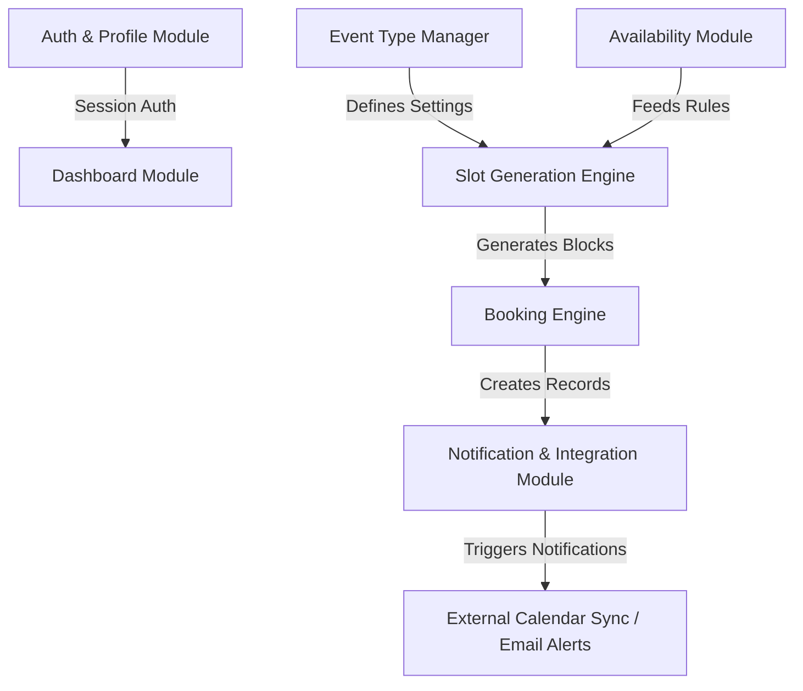
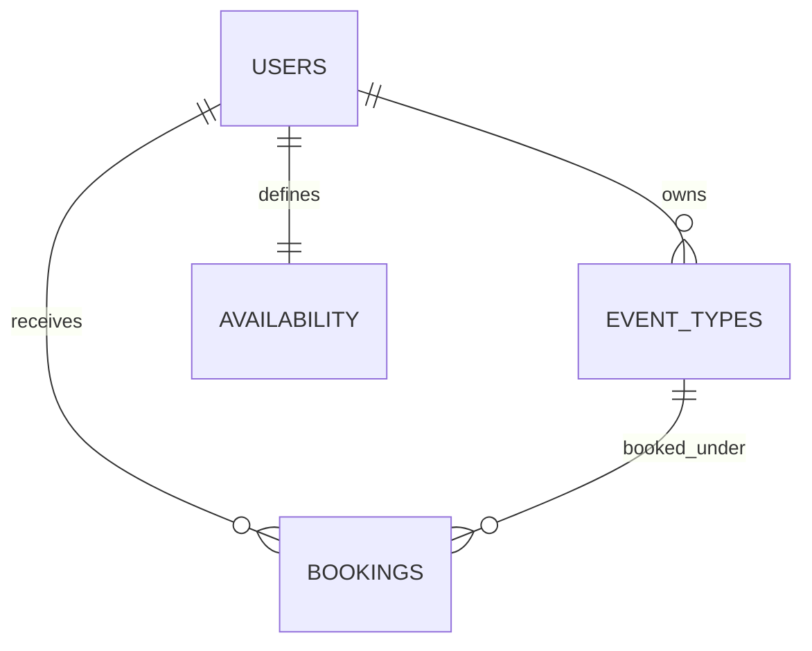

# CalClone: Production-Grade Scheduling & Booking Platform
## Complete Technical Specification & Implementation Plan
### Prepared for SDE Engineering Project Submission (MERN Stack)

---

## 1. Project Folder Structure (Monorepo Specification)

To ensure clean separation of concerns, type sharing, and standard configuration across both the client and server, a high-performance **npm workspaces monorepo** is designed. This approach allows high velocity, easy shared utilities, and a clean build pipeline.

```text
cal-clone/
├── package.json                         # Monorepo root configuration and workspace definitions
├── tsconfig.json                        # Base TypeScript configurations
├── turbo.json                           # Turborepo task pipeline (optional, for rapid caching)
├── README.md                            # High-level overview and boot-up instructions
│
├── apps/
│   ├── web/                             # Frontend (Next.js 15 App Router)
│   │   ├── package.json
│   │   ├── tsconfig.json
│   │   ├── tailwind.config.ts
│   │   ├── next.config.ts
│   │   ├── public/                      # Static assets (logos, icons, illustrations)
│   │   └── src/
│   │       ├── app/                     # Next.js 15 App Router pages & API routes
│   │       │   ├── (auth)/              # Group: login, register, forgot-password
│   │       │   ├── (dashboard)/         # Group: dashboard shell, event-types, availability, bookings
│   │       │   ├── [username]/          # Dynamic booking page: public profile page
│   │       │   │   └── [eventSlug]/     # Slot selection & booking form
│   │       │   ├── layout.tsx
│   │       │   └── page.tsx             # Landing Page
│   │       ├── components/              # Frontend component library
│   │       │   ├── ui/                  # shadcn/ui base elements (Button, Input, Dialog, etc.)
│   │       │   ├── dashboard/           # Dashboard-specific composite components
│   │       │   ├── booking/             # Slot pickers, calendar widgets, confirmation forms
│   │       │   └── shared/              # Navbar, Sidebar, Footer, State indicators
│   │       ├── hooks/                   # Custom React hooks (useAuth, useAvailability, etc.)
│   │       ├── lib/                     # Axios instance, utility functions, dayjs/date-fns helper config
│   │       ├── store/                   # Client state management (Zustand stores)
│   │       └── types/                   # Frontend-specific type definitions
│   │
│   └── server/                          # Backend (Node.js & Express.js with TypeScript)
│       ├── package.json
│       ├── tsconfig.json
│       ├── src/
│       │   ├── server.ts                # Application entry point
│       │   ├── app.ts                   # Express app configuration & middleware pipeline
│       │   ├── config/                  # Database connections, env declarations, integrations
│       │   ├── controllers/             # Request handlers (auth, bookings, availability, etc.)
│       │   ├── models/                  # Mongoose schemas & TypeScript interfaces
│       │   ├── routes/                  # Express Router definitions
│       │   ├── middlewares/             # Auth guards, validation rules, rate-limiters, error interceptors
│       │   ├── services/                # Core business logic (Slot calculation, Mailer, Calendar sync)
│       │   ├── utils/                   # DateTime conversion, response helpers, validators
│       │   └── types/                   # Backend namespace and request overrides
│
└── packages/                            # Shared configurations & types across both packages
    ├── types/                           # Unified TypeScript definitions (Contracts, DTOs, Enums)
    │   ├── package.json
    │   └── index.ts
    └── eslint-config/                   # Shared ESLint parameters
```

---

## 2. Core Modules Architecture

The system is decomposed into six decoupled modules that interact via service interfaces:



### 2.1 Auth & Profile Module
*   **Purpose**: Handles secure signup/login, session control, user timezones, and public custom profile slugs.
*   **Scope**: Secure authentication, dynamic routing lookup by `username`, and storage of profile configurations (e.g., custom avatar, display name).

### 2.2 Event Type Manager
*   **Purpose**: Allows users to configure multiple meeting templates (e.g., "15-minute quick call", "1-hour deep dive").
*   **Scope**: Handles durations, custom titles, dynamic custom slugs (e.g., `/yuvraj/15min`), locations (Google Meet, Zoom, In-person), visibility, and custom buffer windows.

### 2.3 Availability Module
*   **Purpose**: Manages when the user is open to meetings.
*   **Scope**: Supports complex, repeating availability models (e.g., Mon–Fri: 9 AM to 5 PM EST) and date overrides (specific dates with custom hours or fully blocked windows).

### 2.4 Slot Generation Engine (Core Logic)
*   **Purpose**: Dynamically computes open, bookable time periods on a host's calendar for a visitor.
*   **Scope**: Integrates availability rules, already confirmed bookings, timezone variance, duration periods, and padding buffers to present zero-conflict options.

### 2.5 Booking Engine
*   **Purpose**: Oversees public booking flows, client data entry, and database record insertions.
*   **Scope**: Manages reservation form inputs, handles race-condition booking requests, processes cancellations, and coordinates conflicts.

### 2.6 Notification & Integration Module
*   **Purpose**: Triggers communications and synchronizations when a booking is created, updated, or cancelled.
*   **Scope**: Formulates transaction emails (Nodemailer/SendGrid) for both host and guest, coordinates video link creations (mock integration, extensible to Zoom/Google Meet), and supports standard calendar event generations (ICS formats).

---

## 3. Required Pages (Next.js Routing)

Designed to utilize Next.js 15 file-system routing. Standardizes layouts to separate unauthenticated public landing zones from the secure dashboard canvas.

### 3.1 Public Marketing & Auth Pages
*   `app/page.tsx` — **Landing Page**: Highly aesthetic homepage showing dynamic product mockups, pricing models, and direct conversion CTAs.
*   `app/(auth)/login/page.tsx` — **Sign In**: Interactive email/password authorization with glassmorphism overlays and social mock OAuth panels.
*   `app/(auth)/register/page.tsx` — **Registration**: User registration flow with immediate workspace/username slug reservation check.
*   `app/(auth)/forgot-password/page.tsx` — **Password Recovery**: Step-by-step password recovery trigger.

### 3.2 Secure Dashboard Canvas (Behind Auth Guard)
*   `app/(dashboard)/layout.tsx` — **Dashboard Layout**: Features an elegant responsive navigation sidebar, dynamic header, and global command palette search interface.
*   `app/(dashboard)/dashboard/page.tsx` — **Overview Control Panel**: Visual stats (upcoming bookings, total event types), quick-action buttons, and quick-toggle toggling on/off individual event rules.
*   `app/(dashboard)/event-types/page.tsx` — **Event Type Catalog**: View, filter, search, and toggle active status of all meeting configurations.
*   `app/(dashboard)/event-types/new/page.tsx` & `/event-types/[id]/page.tsx` — **Event Configuration Panel**: Detailed forms with tabbed sub-sections: "General settings", "Location", "Booking form customizations", and "Limits (Buffers, notice periods)".
*   `app/(dashboard)/availability/page.tsx` — **Availability Studio**: Visually pleasing weekly scheduler, timezone manager, and calendar date-override drawer.
*   `app/(dashboard)/bookings/page.tsx` — **Bookings Log**: Structured, tabbed list view separating "Upcoming", "Past", and "Cancelled" scheduling entries. Allows immediate cancellation actions.

### 3.3 Dynamic Public Booking Flow
*   `app/[username]/page.tsx` — **Public Host Profile Page**: Standard profile landing page showing the host name, bio, and interactive cards for all their active event templates.
*   `app/[username]/[eventSlug]/page.tsx` — **Interactive Scheduler Page**: Split-panel layout: left-side summarizes the event (Host Name, Title, Duration, Location details); right-side shows a dynamic, responsive month-view calendar and side-loaded grid of generated bookable slots.
*   `app/[username]/[eventSlug]/book/page.tsx` — **Guest Booking Form Page**: Clean form collecting Guest Name, Guest Email, custom questions, and note details. Includes a prominent progress indicator.
*   `app/[username]/[eventSlug]/success/page.tsx` — **Booking Confirmation Screen**: A beautiful celebratory screen with full booking breakdown, links to add straight to calendar (Google, Outlook, Apple ICS), and subtle Framer Motion success checkmark animations.

---

## 4. Backend APIs Specification

All endpoints are prefixed with `/api/v1` and return standardized, structure-predictable JSON.

### 4.1 Authentication Service (`/api/v1/auth`)
*   `POST /register` — Create a new user account.
    *   *Body*: `{ email, password, username, fullName }`
    *   *Response*: `201 Created` with secure HttpOnly JWT Cookie and user object.
*   `POST /login` — Authenticate and gain session.
    *   *Body*: `{ email, password }`
    *   *Response*: `200 OK` with secure HttpOnly JWT Cookie.
*   `POST /logout` — Destroy server session token.
    *   *Response*: `200 OK` (clears cookie).
*   `GET /me` — Retrieve active session user context.
    *   *Headers*: `Cookie: token=<JWT>`
    *   *Response*: `200 OK` with user details.

### 4.2 Event Type Service (`/api/v1/event-types`)
*   `POST /` — Construct a new event blueprint (Protected).
    *   *Body*: `{ title, slug, duration, description, locationType, locationAddress, isPrivate, bufferTime }`
    *   *Response*: `201 Created`
*   `GET /` — Fetch host's own list of templates (Protected).
    *   *Response*: `200 OK` -> `Array<EventType>`
*   `GET /user/:username/:slug` — Public route to fetch event type details for booking lookup (Public).
    *   *Response*: `200 OK` -> `{ eventType, hostProfile }`
*   `PATCH /:id` — Update event type constraints (Protected).
    *   *Response*: `200 OK`
*   `DELETE /:id` — Hard/Soft delete event configuration (Protected).
    *   *Response*: `200 OK`

### 4.3 Availability Service (`/api/v1/availability`)
*   `GET /` — Query user availability schedule (Protected).
    *   *Response*: `200 OK` -> `{ timezone, weeklySlots: [...], dateOverrides: [...] }`
*   `PUT /` — Save full weekly schedule and date overrides atomic layout (Protected).
    *   *Body*: `{ timezone, weeklySlots: Array<{ dayOfWeek, startTime, endTime, active }>, dateOverrides: Array<{ date, startTime, endTime, blocked }> }`
    *   *Response*: `200 OK`

### 4.4 Booking Service (`/api/v1/bookings`)
*   `GET /` — Retrieve host's bookings (Protected).
    *   *Query*: `?status=upcoming|past|cancelled`
    *   *Response*: `200 OK` -> `Array<Booking>`
*   `POST /public/book` — Commit a guest booking (Public).
    *   *Body*: `{ eventTypeId, hostId, startTime, endTime, guestName, guestEmail, guestNotes, timezone }`
    *   *Response*: `201 Created`
*   `POST /:id/cancel` — Revoke scheduling (Protected/Public links with tokens).
    *   *Body*: `{ reason }`
    *   *Response*: `200 OK`

### 4.5 Slot Calculations (`/api/v1/slots`)
*   `GET /public` — Fetch calculated schedule slots (Public).
    *   *Query*: `?username=yuvraj&eventSlug=15min&date=2026-05-25&timezone=Asia/Kolkata`
    *   *Response*: `200 OK` -> `{ date, slots: Array<string> }` (e.g., `["2026-05-25T09:00:00.000Z", "2026-05-25T09:15:00.000Z"]`)

---

## 5. MongoDB Collections Schema Design

We configure rigorous Mongoose models complete with type checking, custom validator structures, and indexing rules to support lightning-fast booking scans.



### 5.1 Users Collection (`users`)
```typescript
import { Schema, model } from 'mongoose';

const UserSchema = new Schema({
  username: { type: String, required: true, unique: true, lowercase: true, trim: true, index: true },
  email: { type: String, required: true, unique: true, lowercase: true, trim: true },
  passwordHash: { type: String, required: true },
  fullName: { type: String, required: true },
  avatarUrl: { type: String, default: '' },
  bio: { type: String, default: '' },
  timezone: { type: String, required: true, default: 'UTC' },
  active: { type: Boolean, default: true }
}, { timestamps: true });

export const UserModel = model('User', UserSchema);
```

### 5.2 Event Types Collection (`event_types`)
```typescript
const EventTypeSchema = new Schema({
  userId: { type: Schema.Types.ObjectId, ref: 'User', required: true, index: true },
  title: { type: String, required: true },
  slug: { type: String, required: true, trim: true },
  description: { type: String },
  duration: { type: Number, required: true }, // in minutes
  locationType: { type: String, enum: ['google-meet', 'zoom', 'in-person', 'phone'], default: 'google-meet' },
  locationDetails: { type: String }, // address or link
  bufferTime: { type: Number, default: 0 }, // buffer in minutes after the meeting
  isPrivate: { type: Boolean, default: false },
  isActive: { type: Boolean, default: true }
}, { timestamps: true });

// Ensure slugs are unique per host user
EventTypeSchema.index({ userId: 1, slug: 1 }, { unique: true });
```

### 5.3 Availability Collection (`availability`)
```typescript
const DayScheduleSchema = new Schema({
  dayOfWeek: { type: Number, required: true, min: 0, max: 6 }, // 0 = Sunday, 6 = Saturday
  startTime: { type: String, required: true }, // "HH:MM" (e.g. "09:00")
  endTime: { type: String, required: true }, // "HH:MM" (e.g. "17:00")
  active: { type: Boolean, default: true }
});

const DateOverrideSchema = new Schema({
  date: { type: String, required: true }, // "YYYY-MM-DD"
  startTime: { type: String, required: true },
  endTime: { type: String, required: true },
  blocked: { type: Boolean, default: false } // block entire date
});

const AvailabilitySchema = new Schema({
  userId: { type: Schema.Types.ObjectId, ref: 'User', required: true, unique: true, index: true },
  timezone: { type: String, required: true, default: 'UTC' },
  weeklySlots: [DayScheduleSchema],
  dateOverrides: [DateOverrideSchema]
}, { timestamps: true });
```

### 5.4 Bookings Collection (`bookings`)
```typescript
const BookingSchema = new Schema({
  eventTypeId: { type: Schema.Types.ObjectId, ref: 'EventType', required: true },
  hostId: { type: Schema.Types.ObjectId, ref: 'User', required: true, index: true },
  guestName: { type: String, required: true },
  guestEmail: { type: String, required: true, index: true },
  guestTimezone: { type: String, required: true, default: 'UTC' },
  guestNotes: { type: String },
  startTime: { type: Date, required: true, index: true }, // stored as UTC ISO String
  endTime: { type: Date, required: true, index: true },
  status: { type: String, enum: ['confirmed', 'cancelled'], default: 'confirmed', index: true },
  cancellationReason: { type: String }
}, { timestamps: true });

// Partial Compound Unique Index: Prevents same host from double bookings
BookingSchema.index(
  { hostId: 1, startTime: 1, status: 1 },
  { 
    unique: true, 
    partialFilterExpression: { status: 'confirmed' } 
  }
);
```

---

## 6. Scheduling Logic & Slot Generation Architecture

The heart of Cal.com's core IP lies in timezone math and rapid interval division. The solution handles dates strictly using a single absolute timezone reference (**UTC**) in database transactions, while projecting local representation on frontend pickers.

### 6.1 Timezone Handling Strategy
1.  **Storage**: All database entries in `bookings` save `startTime` and `endTime` in UTC ISO format (`YYYY-MM-DDTHH:MM:SS.sssZ`).
2.  **Availability**: Stored in the host's selected profile timezone (e.g. `America/New_York`).
3.  **Client Representation**: The frontend identifies the guest's local system timezone (via `Intl.DateTimeFormat().resolvedOptions().timeZone` or custom selector) and requests calculations formatted to that frame.

### 6.2 The Complete Slot Generation Algorithm (Core Logic code template)

Below is the optimized slot generation function executed in `/src/services/slotGenerator.ts` on the backend:

```typescript
import dayjs from 'dayjs';
import utc from 'dayjs/plugin/utc';
import timezone from 'dayjs/plugin/timezone';
import isSameOrBefore from 'dayjs/plugin/isSameOrBefore';
import isSameOrAfter from 'dayjs/plugin/isSameOrAfter';

dayjs.extend(utc);
dayjs.extend(timezone);
dayjs.extend(isSameOrBefore);
dayjs.extend(isSameOrAfter);

interface WeeklyAvailability {
  dayOfWeek: number;
  startTime: string; // "09:00"
  endTime: string;   // "17:00"
  active: boolean;
}

interface DateOverride {
  date: string; // "YYYY-MM-DD"
  startTime: string;
  endTime: string;
  blocked: boolean;
}

interface ExistingBooking {
  startTime: Date;
  endTime: Date;
}

export function generateSlots({
  targetDate,        // "YYYY-MM-DD" (Target day the visitor is looking at)
  duration,          // Event duration in minutes (e.g. 30)
  bufferTime,        // Host buffer in minutes (e.g. 10)
  hostTimezone,      // "America/New_York"
  weeklySchedule,    // Host raw availability rules
  dateOverrides,     // Host date overrides
  existingBookings,  // Array of confirmed booking objects for this date
  guestTimezone      // "Asia/Kolkata"
}: {
  targetDate: string;
  duration: number;
  bufferTime: number;
  hostTimezone: string;
  weeklySchedule: WeeklyAvailability[];
  dateOverrides: DateOverride[];
  existingBookings: ExistingBooking[];
  guestTimezone: string;
}): string[] {
  
  // 1. Resolve host active working range for target date (applying overrides first)
  const override = dateOverrides.find(o => o.date === targetDate);
  let periods: { start: string; end: string }[] = [];

  if (override) {
    if (override.blocked) return []; // Fully blocked today
    periods.push({ start: override.startTime, end: override.endTime });
  } else {
    const dayOfWeek = dayjs(targetDate).day();
    const daySchedule = weeklySchedule.find(s => s.dayOfWeek === dayOfWeek && s.active);
    if (!daySchedule) return []; // Not working this day
    periods.push({ start: daySchedule.startTime, end: daySchedule.endTime });
  }

  const bookableSlots: string[] = [];

  // 2. Process bookable blocks
  for (const period of periods) {
    // Generate dayjs objects for host times relative to targetDate in Host's timezone
    const hostStart = dayjs.tz(`${targetDate}T${period.start}:00`, hostTimezone);
    const hostEnd = dayjs.tz(`${targetDate}T${period.end}:00`, hostTimezone);

    let currentSlotStart = hostStart;
    const intervalDelta = duration + bufferTime;

    while (currentSlotStart.add(duration, 'minute').isSameOrBefore(hostEnd)) {
      const currentSlotEnd = currentSlotStart.add(duration, 'minute');
      
      // Determine slot overlap with existing bookings (fully converted to UTC comparisons)
      const slotStartUTC = currentSlotStart.utc();
      const slotEndUTC = currentSlotEnd.utc();

      let hasOverlap = false;

      for (const booking of existingBookings) {
        const bookStartUTC = dayjs(booking.startTime).utc();
        const bookEndUTC = dayjs(booking.endTime).utc();

        // Calculate overlap applying event buffers
        const paddedBookingStart = bookStartUTC.subtract(bufferTime, 'minute');
        const paddedBookingEnd = bookEndUTC.add(bufferTime, 'minute');

        // Check if slot overlaps with padded booking window
        if (
          (slotStartUTC.isBefore(paddedBookingEnd) && slotEndUTC.isAfter(paddedBookingStart))
        ) {
          hasOverlap = true;
          break;
        }
      }

      // Ensure booking target slot is in the future
      if (!hasOverlap && slotStartUTC.isAfter(dayjs().utc())) {
        // Output formatted in standard UTC string to prevent client parsing discrepancies
        bookableSlots.push(slotStartUTC.toISOString());
      }

      currentSlotStart = currentSlotStart.add(intervalDelta, 'minute');
    }
  }

  // 3. Return collection of UTC times (Frontend is responsible for rendering in GuestTimezone)
  return bookableSlots;
}
```

### 6.3 Double Booking Prevention Strategy
A production environment must address concurrency. Two users booking the same slot at the exact same millisecond can trigger race conditions. We mitigate this through three layers:

```text
[HTTP Request] 
      │
      ▼
1. Redis Lock ────► Check if Key "lock:hostId:startTime" exists
      │             (Pessimistic concurrency limit)
      ▼
2. API Validation ──► Count conflicting overlapping booking records
      │
      ▼
3. Mongoose Transaction ──► Atomic Insert & Unique Partial Compound Index Match
      │
      ▼
[Success Confirmed]
```

1.  **Pessimistic Lock (Redis)**: Before accepting a booking, create a lock on key `lock:booking:${hostId}:${startTime}` with a TTL of 10 seconds.
    ```typescript
    const lockKey = `lock:booking:${hostId}:${startTime}`;
    const acquired = await redis.set(lockKey, 'locked', 'NX', 'PX', 10000);
    if (!acquired) {
      throw new Error('This slot is currently being held by another booking attempt.');
    }
    ```
2.  **Mongoose ACID Transactions & Check**:
    ```typescript
    const session = await mongoose.startSession();
    session.startTransaction();
    try {
      // Find conflicts
      const conflict = await BookingModel.findOne({
        hostId,
        status: 'confirmed',
        $or: [
          { startTime: { $lt: requestedEndTime, $gte: requestedStartTime } },
          { endTime: { $gt: requestedStartTime, $lte: requestedEndTime } }
        ]
      }).session(session);

      if (conflict) throw new Error('Slot already booked.');

      const newBooking = new BookingModel(bookingData);
      await newBooking.save({ session });
      await session.commitTransaction();
    } catch (e) {
      await session.abortTransaction();
      throw e;
    } finally {
      session.endSession();
      await redis.del(lockKey); // release lock
    }
    ```
3.  **Unique Compound Indexes**: Covered in Mongoose Schema 5.4. If transactions and Redis fails, database level constraint acts as the final line of defense to abort duplicate records.

---

## 7. Reusable Frontend Components

Built leveraging the high-performing dynamic capabilities of **shadcn/ui** (Radix UI primitives underneath) and **Tailwind CSS**.

### 7.1 Component Inventory

| Component Name | Core Technology | Props Interface | Description |
| :--- | :--- | :--- | :--- |
| `Button` | shadcn / Tailwind / Lucide Icons | `variant`, `size`, `isLoading`, `icon` | Dynamic button handling animations, loader spinners. |
| `InteractiveCalendar` | Radix / date-fns / Framer Motion | `selectedDate`, `onChange`, `availableDates[]` | A high-end grid visualizer supporting keyboard nav, showing fully-available days. |
| `SlotGrid` | Tailwind Grid / Framer Motion | `slots[]`, `selectedSlot`, `onSelect`, `isLoading` | Grid list of generated times. Slides out with smooth entrance animations. |
| `TimezoneSelector` | Radix Select / Fuse.js search | `value`, `onChange` | Dropdown containing all standard timezones with client search features. |
| `CreateEventModal` | Radix Dialog | `isOpen`, `onClose`, `onSubmitSuccess` | Form drawer for fast event layout definitions. |
| `DashboardShell` | React Server Components | `children`, `activeTab` | Unified dashboard shell wrapping responsive Sidebar and sticky navbar. |
| `StatusBadge` | Tailwind CSS | `status: 'confirmed' \| 'cancelled'` | HSL rounded badge styling. |

### 7.2 Core Calendar Picker Implementation Details (Sample Interface)
```typescript
interface CalendarProps {
  currentMonth: Date;
  onMonthChange: (date: Date) => void;
  selectedDate: Date | null;
  onDateSelect: (date: Date) => void;
  daysWithAvailableSlots: string[]; // YYYY-MM-DD
}
```

---

## 8. Frontend-Backend Communication Strategy

To ensure fluid transitions and reactive UI performance:

### 8.1 Data Fetching and Mutation State
*   **React Query (TanStack Query v5)** is utilized to manage frontend caching, query invalidations, background re-validation, and programmatic mutations.
*   **Axios Client Setup**: Formulated inside `/src/lib/api-client.ts`. Includes standard base URL mapping, payload parsing, and standard error interceptors.

```typescript
import axios from 'axios';

export const apiClient = axios.create({
  baseURL: process.env.NEXT_PUBLIC_API_URL || 'http://localhost:5000/api/v1',
  withCredentials: true, // Crucial for HttpOnly Auth Cookie transmission
  headers: {
    'Content-Type': 'application/json'
  }
});

// Response interceptor to catch 401s and redirect to login
apiClient.interceptors.response.use(
  (response) => response,
  (error) => {
    if (error.response?.status === 401 && typeof window !== 'undefined') {
      window.location.href = '/login';
    }
    return Promise.reject(error);
  }
);
```

### 8.2 Authentication Flow Strategy
*   **Token Delivery**: Strict **HttpOnly Secure SameSite=Lax Cookie** authentication. The frontend React runtime does not store JWT inside LocalStorage (mitigating XSS vulnerabilities).
*   **AuthContext Provider**: A top-level context provider loads profile info inside App Layout via `/api/v1/auth/me` on startup.

---

## 9. Project Conventions & Naming Standards

Rigorous styling rules guarantee clean, standardized code across the workspace.

### 9.1 Naming Structures
*   **Folders**: kebab-case (`components/event-types`, `app/forgot-password`).
*   **React Components**: PascalCase (`InteractiveCalendar.tsx`, `DashboardShell.tsx`).
*   **Utility Files & Hooks**: camelCase (`slotGenerator.ts`, `useAuth.ts`).
*   **Database Collections**: lowercase snake_case plural (`event_types`, `bookings`).
*   **Env Variables**: UPPERCASE (`MONGO_URI`, `JWT_SECRET`).

### 9.2 TypeScript Strict Guidelines
*   `noImplicitAny: true` enforced in `tsconfig.json`.
*   Avoid using `any`. Explicitly declare type interfaces or inline signatures.
*   Utilize API contract models globally inside `packages/types`.

### 9.3 Linting & Formatting Rules
*   **Prettier** parameters: Single quotes, 2-space indentation, semicolons, and trailing commas.
*   **ESLint**: Strict configurations for React Hooks, import sorting, and Next.js recommended sets.

---

## 10. Git Workflow & Branching Strategy

A robust, GitFlow-inspired branching strategy is defined to keep main branches deployable and ensure code quality.

### 10.1 Branch Layout
*   `main`: Mirror of the production deployment. Only clean, tested, and reviewed code is merged here via release branches.
*   `develop`: Integration branch. Feeds active development updates together.
*   `feature/*` (e.g. `feature/slot-generation-engine`): Specific feature branch. Branches out from `develop` and merges back.
*   `bugfix/*` (e.g. `bugfix/timezone-picker-alignment`): Hotfix or bug branches.
*   `release/*`: Integration release branch before merging into production `main`.

### 10.2 Commit Guidelines (Conventional Commits)
All commit titles should specify type and message details:
*   `feat(auth): integrate secure httponly jwt cookie session`
*   `fix(slots): resolve overlapping timezone edge case buffer calculation`
*   `refactor(db): rewrite event schema unique compound indexing`
*   `docs(api): document slot endpoints input properties`

### 10.3 Pull Request Protocol
1.  Target all feature PRs to merge into the `develop` branch.
2.  Mandatory checkouts: CI must pass compilation (`npm run build`), typescript flags (`npm run typecheck`), and lint checks successfully.
3.  Minimum 1 senior/peer review sign-off before merge is permitted.

---

## 11. Phase-Wise Implementation Roadmap

```text
Phase 1 (W1)   ──► Phase 2 (W2)   ──► Phase 3 (W3)   ──► Phase 4 (W4)   ──► Phase 5 (W5)   ──► Phase 6 (W6)
Setup, Auth,       Event &            Slot Engine &      Booking &          Integrations &     CI/CD, Tests &
DB Models          Availability       UTC Calculations   Public Forms       Resiliency         Final Audits
```

### Phase 1: Foundation & Authentication (Week 1)
*   **Milestones**: Monorepo configurations, Mongoose connector setups, user account modules.
*   **Deliverables**: Fully running express server, next.js setup, functional Register/Login UI, user JWT cookies implementation.

### Phase 2: Configuration Suite (Week 2)
*   **Milestones**: Event Type forms and Availability schedule dashboards.
*   **Deliverables**: UI dashboards for creating, modifying events, and weekly availability schedule management with timezone settings.

### Phase 3: Core Algorithm Build (Week 3)
*   **Milestones**: Slot Generation Engine construction and integration tests.
*   **Deliverables**: Complete `/api/v1/slots/public` endpoint operating UTC translations, date overrides, and event padding rules.

### Phase 4: Public Booking Flows (Week 4)
*   **Milestones**: Host profile pages, interactive date calendar controls, slot selection widgets, and conflict checks.
*   **Deliverables**: Smooth customer booking experience with race-condition protections enabled.

### Phase 5: Notifications & Webhook Alerts (Week 5)
*   **Milestones**: Dynamic email notification templates, cancellation portal features, ICS format file builders.
*   **Deliverables**: Fully formatted transactional host/guest booking notification emails and cancellation systems.

### Phase 6: Resiliency, Auditing & Deployment (Week 6)
*   **Milestones**: Security rate limiting, visual polish, testing suite, production cloud deployments.
*   **Deliverables**: Live production deployment links, robust system documentation, and passing end-to-end testing cycles.

---

## 12. Non-Functional Requirements (NFRs)

*   **Performance (Load speed)**: Landing and public booking screens must load within `< 1.2s` (LCP) to avoid user drop-off.
*   **Security (OWASP Top 10 mitigation)**:
    *   Protect backend using `helmet` package to inject secure HTTP response headers.
    *   Set strict CORS controls permitting only the dynamic client App domain.
    *   Implement API Rate Limit rules using `express-rate-limit` (Max 100 requests per 15 minutes per IP).
*   **Reliability & Availability**: Formulate an uptime target of `99.9%`. Implement automated database backups via MongoDB Atlas.
*   **Accessibility (WCAG 2.1)**: Ensure booking page layouts have a contrast score of `> 4.5:1` and can be navigated via keyboard (WAI-ARIA compliant shadcn elements).

---

## 13. Scalability Considerations

1.  **Read Heavy Slot Calculations**: Public booking slot generations represent a read-heavy operation. We implement **Redis Caching** with a 60-second TTL on `/api/v1/slots/public` lookups, invalidated immediately on new bookings.
2.  **Database Index Optimization**: Formulate single-field and compound indexes for high-frequency queries (e.g. `{ hostId: 1, startTime: 1 }`).
3.  **Horizontal Scalability**: Ensure the Express backend remains fully stateless. All user sessions reside in JWTs or databases. This permits deploying the Node process in scalable containers (AWS ECS, Docker) behind a Load Balancer.

---

## 14. Error Handling Strategy

To avoid breaking the user experience during anomalies, a global, unified structure is used.

### 14.1 Standardized API Error Response
All Express errors map to a standardized shape:
```json
{
  "success": false,
  "error": {
    "code": "BAD_REQUEST",
    "message": "The selected time slot overlaps with an existing appointment.",
    "details": []
  }
}
```

### 14.2 Backend Global Interceptor Middleware
```typescript
import { Request, Response, NextFunction } from 'express';

export class AppError extends Error {
  constructor(public statusCode: number, public code: string, message: string) {
    super(message);
  }
}

export const errorHandler = (err: any, req: Request, res: Response, next: NextFunction) => {
  const statusCode = err.statusCode || 500;
  const errorCode = err.code || 'INTERNAL_SERVER_ERROR';
  
  // Log unexpected errors securely (using a logger like Winston)
  if (statusCode === 500) {
    console.error(`[CRITICAL] Unexpected Error:`, err);
  }

  res.status(statusCode).json({
    success: false,
    error: {
      code: errorCode,
      message: err.message || 'Something went wrong on our end.'
    }
  });
};
```

### 14.3 Frontend Error Boundaries & Toast Systems
*   Wrap dynamic booking interfaces with React **ErrorBoundary** classes to catch unexpected failures and render clean fallback cards.
*   Leverage **shadcn/ui Toast** notification modules to prompt users about network timeout issues or slot conflicts cleanly.

---

## 15. Deployment & CI/CD Strategy

```text
[Local Code Checkin] ──► [GitHub PR Trigger] ──► [CI: ESLint / TS compile / Vitest]
                                                       │ (Success)
                                                       ▼
[Staging Deployment] ◄── [CD Pipeline (GitHub Actions)] ──► [Production Deployment]
```

### 15.1 Cloud Environment Architecture
*   **Frontend (Next.js)**: Deployed to **Vercel** for edge-optimized serverless route operations.
*   **Backend (Express)**: Deployed on **Render** (using Web Services) or **AWS ECS Fargate** inside Docker containers.
*   **Database**: **MongoDB Atlas** shared cluster with global IP whitelist routing and automated snapshots.
*   **Caching & Concurrency Lock Layer**: **Upstash Redis** or **Redis Enterprise Cloud** instance.

### 15.2 CI/CD Automation Pipeline (GitHub Actions)
```yaml
name: CI/CD Pipeline

on:
  push:
    branches: [main, develop]
  pull_request:
    branches: [main, develop]

jobs:
  verify:
    runs-on: ubuntu-latest
    steps:
      - uses: actions/checkout@v3
      - name: Setup Node.js
        uses: actions/setup-node@v3
        with:
          node-version: 18
          cache: 'npm'
      - name: Install dependencies
        run: npm ci
      - name: Lint Workspace
        run: npm run lint
      - name: Validate TypeScript Compile
        run: npm run typecheck
      - name: Run Backend Unit Tests
        run: npm --workspace=server test
```

---
### End of Engineering Specification and Product Requirements Document.
