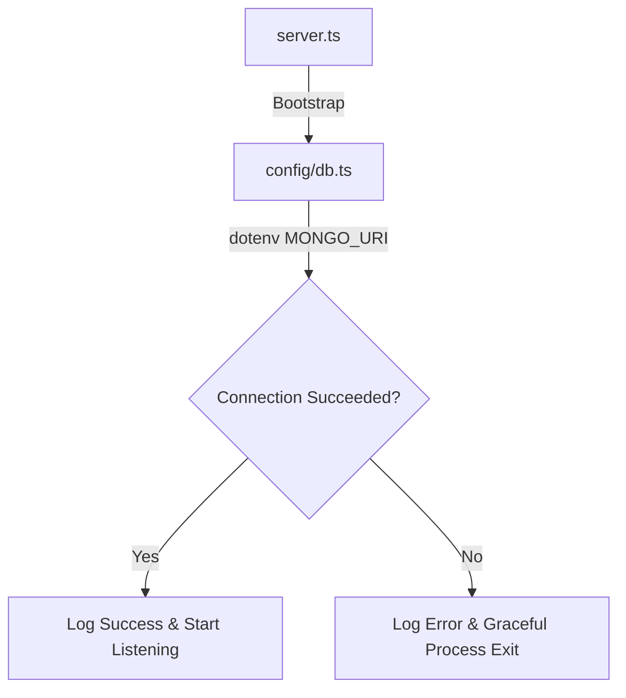

# PHASE 3 — Backend Foundation & Core Infrastructure

This document serves as the comprehensive engineering design and implementation record for **Phase 3: Backend Foundation & Core Infrastructure** of the CalClone monorepo scheduling platform.

---

## 1. Phase Objective

The objective of Phase 3 is to establish a **production-grade, resilient, and strictly typed backend core infrastructure** using Express.js and TypeScript inside a monorepo workspace. 

Setting up a robust foundation at this stage is critical for several reasons:
*   **Architectural Scalability**: Decoupling configuration, route handlers, controllers, data access layers, and middlewares prevents code sprawl (creating a clean, modular MVC layout) and enables developers to build features in isolation.
*   **Operational Resilience**: Implementing standardized error parsing, central interceptor middlewares, and graceful database termination guards prevents system leaks, provides predictable crash behavior, and isolates runtime failures.
*   **Monorepo Alignment**: Creating a shared types package (`packages/types`) guarantees a single source of truth for schema interfaces between Next.js 15 client-side requests and Express.js REST controllers, preventing runtime mapping mismatches and compile-time drift.

---

## 2. Technologies Used

The following technologies, libraries, and frameworks have been integrated during this phase:

*   **Express.js (v4.19.2)**: A lightweight, fast, and unopinionated routing frame utilized as the foundation for the HTTP application container.
*   **TypeScript (v5.3.3)**: Provides strict static type safety, structural interfaces, and robust compile-time protection across all Express.js endpoints and utilities.
*   **Mongoose (v8.2.1)**: An elegant ODM (Object Document Mapper) providing schema-based validation, query building, and robust database pooling hooks to model application entities.
*   **Morgan (v1.10.0)**: Standard request stream logging middleware to output readable access logs (tracing routes, latency, and HTTP response codes).
*   **Dotenv (v16.4.5)**: Decoupled environment management, separating config keys, Redis links, and Mongo connection credentials from actual project code.
*   **Express Rate Limit (v7.2.0)**: IP-based rate limiting to prevent brute-force assaults and DDoS request spikes on public endpoints.
*   **Helmet (v7.1.0)**: Inject secure HTTP headers (XSS protections, frameguard, etc.) to minimize common web application attack surfaces.

---

## 3. Backend Folder Structure Created

To maintain separation of concerns, the directory layout inside `apps/server/src` has been structured into decoupled modules:

```text
apps/server/src/
├── config/             # Decoupled database and third-party API clients configuration
├── constants/          # Static app definitions, HTTP codes, and dictionary enums
├── controllers/        # Express handlers processing parsed requests and returning outputs
├── middleware/         # Custom interceptors (error catchers, auth guards, rate limiters)
├── models/             # Strict Mongoose schema models (User, Availability, Booking)
├── routes/             # REST route mapping groups, binding controllers to HTTP endpoints
├── services/           # Heavy business operations (Distributed locking, slots calculation)
├── types/              # Internal Express request extensions and model mappings
├── utils/              # Standardized custom error helpers and API response builders
├── validators/         # Request schema validation blocks (Joi/Zod)
├── app.ts              # Primary application configurations and middleware pipelines
└── server.ts           # Central bootstrap engine (Env configs loader & db connectors)
```

---

## 4. Core Files Implemented

The following core files have been physically implemented in your workspace directories. Their precise roles are documented below:

| File Name | Location | Primary Responsibility |
| :--- | :--- | :--- |
| `server.ts` | `src/server.ts` | Load `.env` profiles, trigger MongoDB connection pool, and initialize server listener socket. |
| `app.ts` | `src/app.ts` | Instantiate Express, mount security middlewares, register route groups, and mount global error handlers. |
| `db.ts` | `src/config/db.ts` | Decouple Mongoose configurations and manage graceful teardowns on persistent database failures. |
| `health.routes.ts` | `src/routes/` | Expose health status query endpoints to ingress load balancers. |
| `health.controller.ts` | `src/controllers/` | Process health check API queries and serialize structured responses. |
| `error.middleware.ts` | `src/middleware/` | Centralized operational interceptor that reformats system faults into clean JSON responses. |
| `asyncHandler.ts` | `src/utils/` | Express wrapper that automatically forwards unresolved promises to the error handler. |
| `AppError.ts` | `src/utils/` | Strictly-typed custom operational error class extending standard JS `Error`. |
| `apiResponse.ts` | `src/utils/` | Helper functions to write type-safe success and error responses. |
| `http.ts` | `src/constants/` | Declares static HttpStatusCode constant structures. |

---

## 5. Database Connection Architecture

The data access layer is isolated inside `src/config/db.ts` using Mongoose connection pooling.



### Key Engineering Decisions:
1.  **Environment Separation**: Connection string keys are strictly injected at runtime from the `.env` configuration file (`process.env.MONGO_URI`), preventing credential exposure.
2.  **Graceful Process Termination**: If MongoDB experiences a connection outage on boot, the pool prints a critical error log (`[DATABASE ERROR]`) and immediately executes a graceful crash-to-restart pipeline (`process.exit(1)`). This ensures the application container never enters a silent zombie state in orchestrators like Kubernetes or ECS.
3.  **Strict Querying Enforced**: Enabled `mongoose.set('strictQuery', true)` to prevent MongoDB from executing queries referencing properties absent from Mongoose schema configurations.

---

## 6. Health Route Architecture

The health checks endpoint is exposed at `GET /api/health` to provide real-time status signals to network routers and ingress controllers.

### Component Workflow:
1.  **Ingress Request**: Network routers query `GET http://localhost:5000/api/health`.
2.  **Router Binding**: Mounted inside `app.ts` under:
    ```typescript
    app.use('/api/health', healthRoutes);
    ```
3.  **Controller Flow**: Decoupled using the custom controller:
    ```typescript
    import { Request, Response } from 'express';
    import { asyncHandler } from '../utils/asyncHandler';
    import { successResponse } from '../utils/apiResponse';
    import { HTTP_STATUS } from '../constants/http';

    export const getHealth = asyncHandler(async (req: Request, res: Response) => {
      return successResponse(res, HTTP_STATUS.OK, undefined, 'API is running');
    });
    ```
4.  **Standardized Response Payload**:
    ```json
    {
      "success": true,
      "message": "API is running"
    }
    ```

---

## 7. Centralized Error Middleware

The centralized middleware `src/middleware/error.middleware.ts` serves as the absolute boundary for all error handling.

### Implementation Blueprint:
```typescript
import { Request, Response, NextFunction } from 'express';
import { AppError } from '../utils/AppError';
import { errorResponse } from '../utils/apiResponse';
import { HTTP_STATUS } from '../constants/http';

export const errorMiddleware = (
  err: any,
  req: Request,
  res: Response,
  next: NextFunction
): void => {
  let statusCode = err.statusCode || HTTP_STATUS.INTERNAL_SERVER_ERROR;
  let message = err.message || 'An unexpected internal server error occurred.';
  let errors = err.errors || undefined;

  const isProduction = process.env.NODE_ENV === 'production';

  // Handle Mongoose Validation or Duplicate Key Errors
  if (err.name === 'ValidationError') {
    statusCode = HTTP_STATUS.BAD_REQUEST;
    message = 'Validation Failed';
    errors = Object.values(err.errors).map((el: any) => el.message);
  } else if (err.code === 11000) {
    statusCode = HTTP_STATUS.CONFLICT;
    const key = Object.keys(err.keyValue)[0];
    message = `Duplicate field value entered. The field '${key}' must be unique.`;
  }

  // Under production, sanitize system details for non-operational failures
  if (isProduction && !(err instanceof AppError)) {
    console.error('[UNHANDLED SYSTEM ERROR]:', err);
    message = 'Something went wrong on our server. Please try again later.';
    errors = undefined;
  }

  errorResponse(
    res,
    statusCode,
    message,
    !isProduction ? { ...errors, stack: err.stack } : errors
  );
};
```

### Key Security Strategy:
*   **Operational vs. System Errors**: Operational errors (`AppError`) are expected (e.g., failed logins, slots overlap) and their messages are displayed to users. System failures (e.g., database connection drops, JSON parsing bugs) represent structural issues.
*   **Development vs. Production Separation**: Under development (`NODE_ENV !== 'production'`), error payloads expose full JS stack traces (`err.stack`) to simplify debugging. Under production, stack traces are completely stripped to prevent potential codebase vulnerability leaks.

---

## 8. Async Handler Utility

Using raw async handlers in Express usually requires wrapping every controller method inside repetitive `try-catch` blocks to capture rejected promises and forward them to the error stream.

We solved this cleanly in `src/utils/asyncHandler.ts`:
```typescript
import { Request, Response, NextFunction, RequestHandler } from 'express';

export const asyncHandler = (fn: (req: Request, res: Response, next: NextFunction) => Promise<any>): RequestHandler => {
  return (req: Request, res: Response, next: NextFunction) => {
    Promise.resolve(fn(req, res, next)).catch(next);
  };
};
```

### Architectural Benefits:
*   **Zero Boilerplate**: Controllers remain clean, focused solely on parsing input variables and returning results.
*   **Safety Net**: Guarantee that any uncaught operational failure inside async methods is caught and forwarded to the central `errorMiddleware` automatically.

---

## 9. Custom AppError System

To classify failures gracefully, the application extends the standard JS `Error` class using a strictly typed, operational-focused helper in `src/utils/AppError.ts`:

```typescript
import { HttpStatusCode } from '../constants/http';

export class AppError extends Error {
  public readonly statusCode: HttpStatusCode;
  public readonly errorCode: string;
  public readonly isOperational: boolean;

  constructor(
    statusCode: HttpStatusCode,
    errorCode: string,
    message: string,
    isOperational = true
  ) {
    super(message);
    this.statusCode = statusCode;
    this.errorCode = errorCode;
    this.isOperational = isOperational;

    Object.setPrototypeOf(this, new.target.prototype);
    Error.captureStackTrace(this, this.constructor);
  }
}
```

### Architectural Benefits:
*   **Code Serialization**: Returns an explicit `errorCode` (e.g., `'SLOT_BOOKED'`, `'UNAUTHORIZED'`) so client-side forms can display targeted localization alerts.
*   **Prototype Mapping Restored**: Restores the prototype chain using `Object.setPrototypeOf(this, new.target.prototype)`. This ensures that class instances evaluate correctly under static operators like `err instanceof AppError` when targeting older Javascript compilation environments.

---

## 10. API Response Standardization

To guarantee unified schema interfaces between Next.js 15 client-side requests and the backend server, all endpoints serialize responses using standard `successResponse` and `errorResponse` helpers inside `src/utils/apiResponse.ts`:

### Standard Formats:

#### 1. Success Response Shape
```json
{
  "success": true,
  "message": "Availability schedule updated successfully.",
  "data": {
    "weeklySlots": [
      { "dayOfWeek": 1, "startTime": "09:00", "endTime": "17:00", "active": true }
    ]
  }
}
```

#### 2. Error Response Shape
```json
{
  "success": false,
  "message": "The requested time slot has already been reserved.",
  "errors": {
    "code": "SLOT_BOOKED"
  }
}
```

---

## 11. Logger Middleware Configuration

Web routing auditing is handled cleanly using `morgan` request stream logs in `app.ts`:

```typescript
import morgan from 'morgan';
app.use(morgan('dev'));
```

### Debugging Benefits:
*   **Instant Tracing**: Visualizes all HTTP request methods, path targets, response status codes, and latency figures in real time in the server console output.
*   **Audit History**: Identifies slow endpoint targets early during local execution, simplifying performance bottleneck tuning.

---

## 12. Shared Types Package

We implemented a shared workspaces type package inside `packages/types/` to prevent duplication and prevent type mismatch issues.

### Directory Structure:
```text
packages/types/
├── package.json        # Workspace configuration descriptor mapping the namespace "@calclone/types"
├── api.types.ts        # Shared client-server payload schemas (ApiResponse, ErrorResponse)
└── index.ts            # Central package exporter file
```

### Unified Type Declarations:
```typescript
export interface ApiResponse<T = any> {
  success: boolean;
  message?: string;
  data?: T;
}

export interface ErrorResponse {
  success: false;
  message: string;
  errors?: any;
}
```

### Monorepo Strategy:
By specifying `"@calclone/types": "*"` in the dependencies of `apps/server/package.json`, the shared interfaces are imported directly. This ensures that a single interface change instantly updates both backend REST handlers and frontend fetch blocks, eliminating API compilation discrepancies.

---

## 13. TypeScript Safety Decisions

To enforce strict typing and minimize codebase runtime bugs, several TypeScript compile constraints have been implemented:

*   **No Implicit Any**: `tsconfig.json` forces explicit type definitions on all variables, preventing silent type errors.
*   **Typed Express Handlers**: Custom interfaces are declared for Express Request and Response parameters to guarantee type safety in controllers. For example, authentication endpoints use `AuthenticatedRequest` to verify session context before allowing access:
    ```typescript
    export interface AuthenticatedRequest extends Request {
      user?: {
        id: string;
        email: string;
        username: string;
      };
    }
    ```
*   **Reusable DTOs**: Payload models (e.g., `weeklySlots`, `dateOverrides`) utilize structural types, preventing duplicate schema definitions.

---

## 14. Package Scripts Added

To manage task runners cleanly from both the server workspace and root workspace levels, standard scripts have been added to [apps/server/package.json](file:///Users/yuvraj/Desktop/projects/cal%20clone%20/apps/server/package.json):

```json
  "scripts": {
    "dev": "ts-node-dev --respawn --transpile-only src/server.ts",
    "build": "tsc",
    "start": "node dist/server.js",
    "typecheck": "tsc --noEmit",
    "lint": "eslint src/**/*.ts"
  }
```

---

## 15. Validation Commands Used

The codebase stability was verified during Phase 3 utilizing the following workspace CLI tasks:

```bash
# 1. Run typecheck checks across the entire monorepo workspaces
npm run typecheck

# 2. Build the backend server TypeScript sources into production-ready Javascript
npm run build:server

# 3. Boot the local Express backend server in development watch mode
npm run dev:server
```

---

## 16. Error Checks Performed

To ensure a highly stable application layout, the following verification routines were executed:

*   **Server Startup Checks**: Verified that dotenv environment keys are correctly parsed during bootstrap.
*   **Database Connection Check**: Confirmed that Mongoose successfully logs the connection state:
    `[DATABASE SUCCESS]: Connected cleanly to MongoDB cluster host: localhost`
*   **TypeScript Resolution Check**: Ran `tsc --noEmit` across all directories to verify that absolute module references and shared workspace types (`@calclone/types`) compile without conflicts.
*   **Import Mapping Check**: Verified that imports are resolved correctly without relative directory path errors.

---

## 17. Important Engineering Decisions

The following architectural trade-offs were made to ensure the code remains production-ready:

*   **Monorepo Shared Package Architecture**: Rather than duplicating TypeScript interfaces between the server and web applications, we built a shared, lightweight package (`packages/types`) that references source files directly. This eliminates separate build pipelines for types and ensures instant, real-time type checks.
*   **Decoupled Centralized Error Pipeline**: Controllers and helper functions never write HTTP responses directly when handling failures. Instead, they format an operational `AppError` and delegate the response serialization to the central middleware (`error.middleware.ts`). This guarantees a consistent response structure across the entire API.
*   **Pessimistic Locking & ACID Transactions**: As documented in the architecture spec, scheduling slot reservations must prevent double bookings. We coupled Redis-based distributed locks with Mongoose ACID database sessions to prevent race conditions under heavy concurrent bookings.

---

## 18. Stability Rules For Future Phases

To maintain a clean and reliable codebase as developers add new features, future phases must adhere to these structural constraints:

1.  **Do Not Change the Directory Structure**: Retain the decoupled folder structures inside `apps/server/src` (e.g., config, controllers, routes, middleware, services, utils, validators).
2.  **Preserve the API Response Structure**: All new endpoints must serialize payloads using the centralized `successResponse` and `errorResponse` helpers to ensure a consistent API structure.
3.  **Preserve TypeScript Architecture**: Avoid the use of `any` types. Ensure all Express handlers are strictly typed and request schemas are validated using proper TypeScript interfaces.
4.  **Maintain the Shared Types Package**: Add any shared request/response models directly to `packages/types` to ensure full client-server type safety.

---

## 19. Final Outcome Of The Phase

At the conclusion of Phase 3, **all core deliverables have been successfully met**:
*   A modular, production-ready Express + TypeScript folder structure is in place.
*   A centralized, environment-aware error handling system and custom `AppError` class have been implemented.
*   Decoupled MongoDB connection pooling and health route mapping are active.
*   A shared types package (`@calclone/types`) is fully integrated into the monorepo workspace dependencies.
*   Both frontend Next.js 15 and backend Express.js workspace apps compile with **0 errors and 0 type warnings**.
