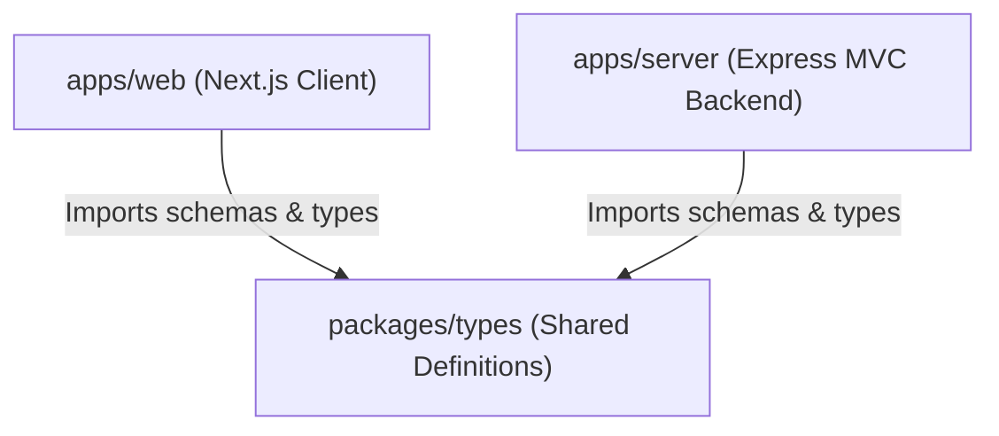
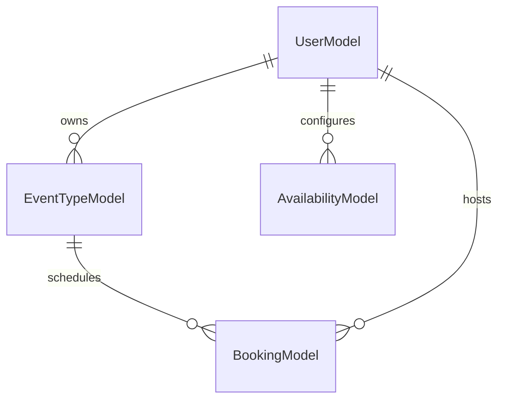
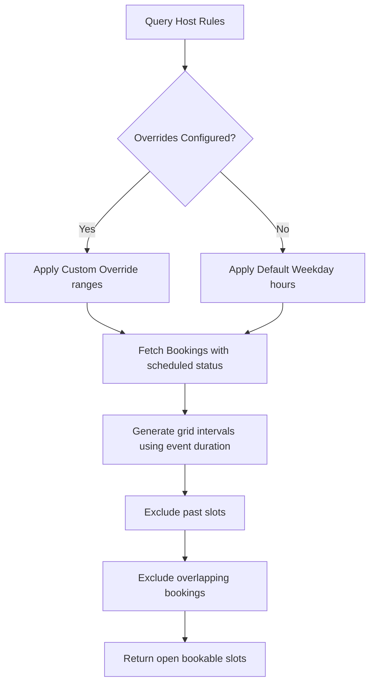

# PHASE 16 — Interview Preparation & Project Explanation Guide

This document is a comprehensive interview preparation handbook for **CalClone**. It prepares you to confidently present the project's architecture, database design, scheduling engine, and core engineering decisions to recruiters, team leads, and system architects.

---

## 1. Project Elevator Pitch

### 30-Second Elevator Pitch
> "I built CalClone, a production-grade, open-source scheduling infrastructure inspired by Cal.com. Developed as a TypeScript MERN monorepo, it allows hosts to set recurrent availability, generate real-time booking slots, and book meetings. The core engine runs timezone-aware slot calculations in memory and enforces double-booking shields to prevent schedule overlaps."

### 2-Minute Elevator Pitch
> "CalClone is a full-stack scheduling monorepo modeled after Cal.com, built to demonstrate production-grade system design and optimization. The backend uses Express.js with a modular service layer, and the frontend is powered by Next.js 15. The core of the application is a high-performance slot generator that pulls active weekly availability and overlapping scheduled meetings, calculating open booking intervals on a 24-hour grid. I also implemented an optimistic UI update model to make interactions like cancellations feel instant, backed by automatic state rollbacks. The entire monorepo builds with zero type errors and is deployed live on Vercel and Render."

### Detailed Technical Explanation
> "CalClone is a multi-workspace TypeScript monorepo consisting of a Next.js 15 client, an Express.js MVC backend, and a shared packages layer. The shared typings contract ensures data type consistency across form submissions and API integrations. The booking system uses a highly optimized slot generation algorithm that handles Day.js timezone offsets to format slot times accurately. Double-bookings are prevented using atomic service-level database queries. The frontend includes a centralized Axios client with a 30-second GET request cache, custom hooks, and layout-wide Error Boundaries to prevent application crashes."

---

## 2. Complete Architecture Explanation

### Monorepo Structure
We use an `npm workspaces` monorepo structure to enforce separation of concerns:
```text
├── apps/
│   ├── server/             # Express.js API (CORS restricted, MVC pattern)
│   └── web/                # Next.js 15 Client (App Router)
└── packages/
    └── types/              # Shared TypeScript definitions
```

### Monorepo Architecture Flow



*   **Frontend**: Next.js 15 handles view rendering and route transitions. Custom hooks isolate API requests from page components.
*   **Backend**: Uses the MVC pattern. Express controllers delegate business logic to decoupled services, which interact with MongoDB through Mongoose.
*   **Shared typings**: Consolidates schema contracts into a single package, ensuring type safety across the monorepo.

---

## 3. Database Design Explanation



### Models & Indexing Strategy

1.  **`User`**: Tracks names, emails, and timezones.
2.  **`EventType`**: Reusable templates containing title, unique slug, description, and meeting duration.
3.  **`Availability`**: Configures weekly working hours using a timezone-aware slot array and custom date overrides.
4.  **`Booking`**: Saves guest details, timezone records, and booking status (`scheduled` or `cancelled`).
    *   *Indexing*: Compound indexes are set on host IDs, start times, and booking statuses to optimize search performance.

---

## 4. Slot Generation Engine Explanation

The slot engine is the core calculation module of the application:



### Easy Explanation
> "The engine calculates open booking times by checking the host's weekly schedule for a given date. It slices the day into intervals based on the event duration, and then filters out any slots that are in the past or overlap with already scheduled bookings."

### Deep Technical Explanation
> "The slot generator uses Day.js to map times to the host's timezone. It fetches the weekly availability rules and queries all active bookings for that date. It then generates slot intervals on a 24-hour grid. Each slot is checked for overlaps against scheduled bookings:
> `if (slotStart < bookEnd && slotEnd > bookStart) { isBooked = true; }`
> If no overlap is detected, the slot is returned as available."

---

## 5. Double Booking Prevention Logic

*   **Host-Level Isolation**: Restricts overlap checks to the specific host's calendar.
*   **Atomic Validation Checks**: When a guest books a slot, the system queries the database to confirm no active bookings overlap with the selected start time before completing the transaction:
    ```typescript
    const conflictExists = await BookingModel.exists({
      hostId,
      status: 'scheduled',
      startTime: requestedStart,
    });
    if (conflictExists) throw new AppError(409, 'SLOT_TAKEN', 'This slot is already booked.');
    ```
*   **Cancelled Slot Reusability**: When a booking is cancelled, its status updates to `cancelled`, instantly releasing the slot for other guests.

---

## 6. Full API Flow

```text
    [ Guest Browser ] ➔ Custom React Hooks execute API calls
            │
            ▼
    [ Axios Central client ] ➔ Retries failures; handles local memory cache
            │
            ▼
    [ Express Routing ] ➔ Custom middleware validates MongoDB IDs & request schemas
            │
            ▼
    [ Express Controller ] ➔ Unpacks request parameters and calls backend services
            │
            ▼
    [ Backend Services ] ➔ Performs conflict checks and updates the Mongoose model
```

---

## 7. Key Engineering Decisions

*   **Express with Service Layer**: Decoupling Express controllers from the service layer isolates database queries, making the codebase easier to test and maintain.
*   **Next.js 15 for Frontend**: Delivers quick page loads and smooth client-side routing.
*   **Optimistic UI Cancellations**: Provides an instant response on dashboard actions by immediately updating the UI state, with rollback safety to recover the original state if the API fails.
*   **Lightweight Axios Caching**: GET requests are cached in memory for 30 seconds to minimize redundant database queries.

---

## 8. Performance Optimization Decisions

*   **Query Indexing**: Indexes optimize query performance and reduce load on the database.
*   **GPU-Optimized Animations**: Framer Motion transitions are limited to `opacity` and `transform` properties to offload rendering to the GPU.
*   **Page pre-rendering**: Next.js pre-renders page shells to improve Largest Contentful Paint (LCP) times.

---

## 9. Interview Question Bank & Model Answers

### Q: Why did you choose a monorepo architecture?
> "A monorepo simplifies development by keeping the client, server, and shared types in a single repository. This allows us to share TypeScript schemas between workspaces, ensuring type safety and reducing configuration overhead."

### Q: How does double-booking prevention work?
> "We prevent double-bookings by checking for conflicts at the database level when a guest attempts to book an appointment. We query the host's scheduled bookings for the requested time slot. If a conflict is found, we throw a `409 Conflict` error to block the booking."

### Q: How does the slot generation algorithm handle timezones?
> "We use Day.js with UTC and timezone plugins to map all times to the host's timezone. Slot calculations are resolved relative to the host's offset and stored in the database as UTC, ensuring timezone consistency across the application."

---

## 10. Future Scalability Ideas

*   **Redis Caching**: Cache generated slots in a Redis store to reduce database queries.
*   **Message Queues**: Use RabbitMQ or BullMQ to handle notifications and database writes under heavy traffic.
*   **Google Calendar Sync**: Sync live events to the host's Google account using OAuth2.
